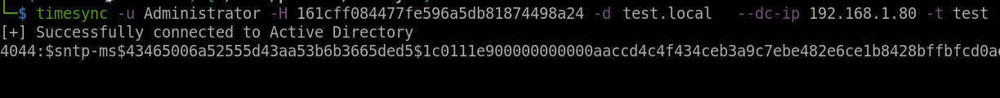

# TimeSync
Tool to obtain hash using MS-SNTP for user accounts

## Requirements

- Python 3.x
- `ldap3` library for LDAP operations

## Installation

1. Clone the repository:
   ```bash
   git clone https://github.com/yourusername/timeroast.git
   cd timeroast
   ```

2. Install the required Python packages:
   ```bash
   pip install .
   ```

### Options

- `-u`, `--username`: Username for authentication (required)
- `-p`, `--password`: Password for authentication (required)
- `-d`, `--domain`: Domain name (required)
- `-H`, `--hash`: NTLM hash for Pass-the-Hash authentication
- `-t`, `--target`: Target user or group to query
- `--dc-ip`: IP address of the domain controller to avoid DNS resolution issues

## Usage

```bash
timesync -u <username> -p <password> -d <domain> -H <ntlm_hash> -t <target_user>
```

## Example
Extract hash for user `test` in domain `test.local`
```bash
timesync -u test -p test -d test.local -t test
```
 

Extract all hashes for users in group `group1` with verbosity
```bash
timesync -u test -p test -d test.local -t group1 -v
```
 

Extract all hashes for users in domain `test.local`
```bash
timesync -u test -p test -d test.local
```
 

## Disclaimer

This tool is intended for educational purposes and authorized penetration testing only. Unauthorized use of this tool is prohibited and may violate local, state, and federal laws.

## License

This project is licensed under the MIT License - see the [LICENSE](LICENSE) file for details.

## Contributing

Contributions are welcome! Please open an issue or submit a pull request for any improvements or bug fixes.
